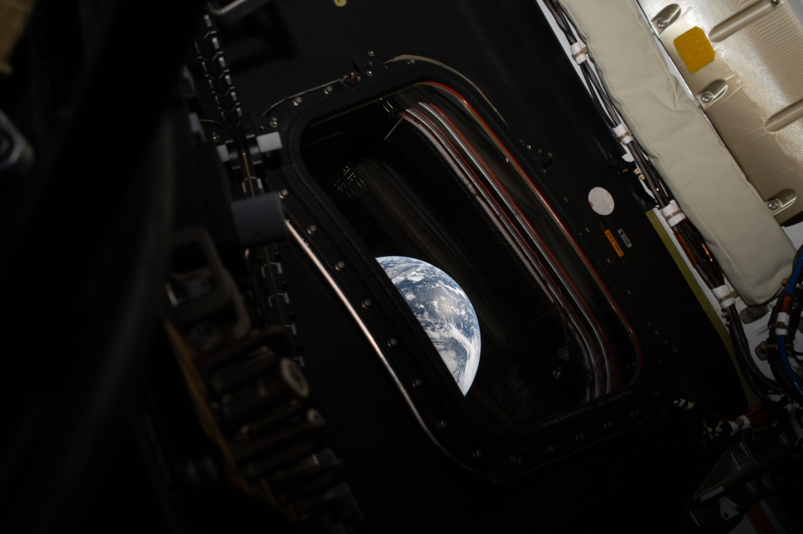

# Artemis II

A dark theme for [Omarchy](https://omarchy.com) inspired by the view of Earth from the Artemis II spacecraft — deep black backgrounds with vivid, high-contrast colors that echo the glow of instruments against the void of space.

## Color Palette

| Color   | Normal    | Bright    |
|---------|-----------|-----------|
| Black   | `#010101` | `#747474` |
| Red     | `#ff5b29` | `#ffa285` |
| Green   | `#39ff39` | `#91ff91` |
| Yellow  | `#ffc548` | `#ffdf97` |
| Blue    | `#5757ff` | `#9d9dff` |
| Magenta | `#ff66ff` | `#ffa4ff` |
| Cyan    | `#a4b9d2` | `#c4d4e4` |
| White   | `#eeeee8` | `#eaeae1` |

- **Background:** `#010101`
- **Foreground:** `#eeeee8`
- **Accent:** `#5757ff`

## Supported Applications

### Terminals
- Alacritty
- Ghostty
- Kitty
- Warp

### Editors
- Neovim (via [aether.nvim](https://github.com/bjarneo/aether.nvim))
- VS Code
- Zed

### Desktop (Hyprland)
- Hyprland (window borders)
- Hyprlock
- Waybar
- Mako (notifications)
- Walker (launcher)
- Wofi (launcher)
- SwayOSD
- GTK 3/4

### Other
- btop
- Chromium
- Vencord (Discord)
- Zellij
